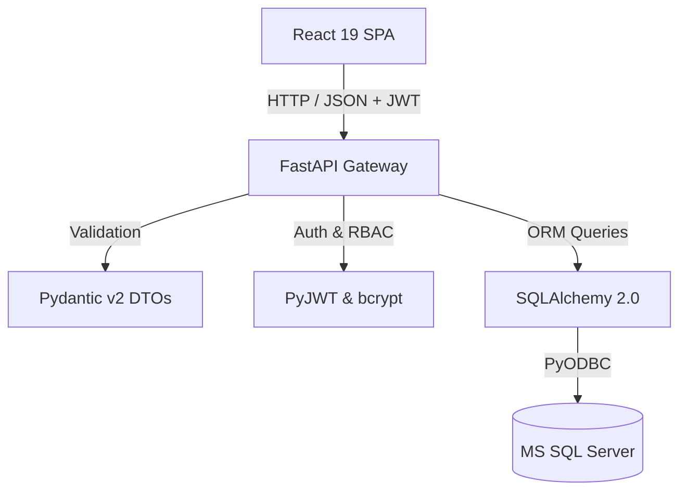

<p align="center">
  
</p>

<h1 align="center">QuestFlow</h1>
<p align="center">
  <strong>Complete Tasks. Earn Progress. Stay Motivated.</strong>
</p>

<p align="center">
  QuestFlow is a modern gamified productivity platform that helps teams manage projects, tasks, and expenses while rewarding operational progress with XP, achievements, and real-time leaderboards.
</p>

---

## 🌟 Features

- **Gamified Task Progression:** Complete tasks to earn XP points, level up, and unlock achievements.
- **Kanban Task Operations:** Dynamic task management with assignment scopes, priorities, and status transitions.
- **Expense Tracking & Approval Engine:** Submit expense claims with receipt attachments and route them to Managers/Admins for review.
- **Real-Time Leaderboard:** Competitive standings filtered by active users sorted by earned XP.
- **Role-Based Access Control (RBAC):** Three distinct authorization tiers (`Admin`, `Manager`, `Employee`) with token rotation security.
- **Dark Futuristic Aesthetic:** Glassmorphic UI styled with React 19, Vite, Framer Motion, and Tailwind CSS v4.

---

## 🛠️ Tech Stack

| Layer | Technology |
| :--- | :--- |
| **Frontend** | React 19, Vite 8, Tailwind CSS v4, Framer Motion, Lucide Icons, Recharts, Playwright E2E |
| **Backend** | Python 3.14, FastAPI, SQLAlchemy 2.0 ORM, Pydantic v2, PyJWT, Pytest |
| **Database** | MS SQL Server / SQL Server Express via PyODBC |
| **Security** | JWT Access & Refresh Token Rotation, bcrypt Password Hashing, RBAC Middleware |

---

## 📁 Repository Layout

```text
task-expense-management/
├── backend/
│   ├── app/
│   │   ├── core/                  # Security, JWT, Pydantic config settings
│   │   ├── db/                    # SQLAlchemy engine & base metadata
│   │   ├── models/                # Database entities (User, Task, Expense, Project)
│   │   ├── routes/                # FastAPI APIRouter endpoints
│   │   └── schemas/               # Request/Response DTOs
│   ├── tests/                     # Pytest backend suite
│   └── seed_e2e_users.py          # Unified database seed script
│
├── frontend/
│   ├── e2e/                       # Playwright end-to-end spec suite
│   ├── public/                    # Static brand assets (logo.svg, favicon.svg)
│   ├── src/
│   │   ├── components/            # UI components (Sidebar, Navbar, Cards, Charts)
│   │   ├── context/               # AuthContext, NotificationContext
│   │   ├── layouts/               # AuthLayout, DashboardLayout
│   │   ├── pages/                 # Full view containers (Dashboard, Tasks, Expenses)
│   │   └── services/              # Axios HTTP client with refresh rotation
│   └── index.html                 # Browser entry point & metadata
└── docs/                          # Architectural blueprints & documentation
```

---

## 🔐 Demo Credentials (Single Source of Truth)

All local dev and automated test setups use these standardized demo accounts:

| Role | Email | Password | Access Tier |
| :--- | :--- | :--- | :--- |
| **Admin** | `admin@gmail.com` | `Admin@123` | Full System Access (Manage Users, Projects, Reports) |
| **Manager** | `manager@gmail.com` | `Manager@123` | Operational Access (Create Tasks, Review Approvals) |
| **Employee** | `employee@gmail.com` | `Employee@123` | Individual Access (Complete Tasks, Submit Expenses) |

---

## ⚙️ Environment Variables

Copy the `.env.example` schema into `.env` at project root:

```env
PROJECT_NAME="QuestFlow"
ENVIRONMENT="development"
API_V1_STR="/api/v1"

# Database Configuration (MS SQL Server)
DATABASE_URL="mssql+pyodbc://localhost/TaskExpenseDB?driver=ODBC+Driver+17+for+SQL+Server&trusted_connection=yes"

# JWT Token Security (Must be set in production)
JWT_SECRET_KEY="your-secure-access-token-secret-key-here"
JWT_REFRESH_SECRET_KEY="your-secure-refresh-token-secret-key-here"
ACCESS_TOKEN_EXPIRE_MINUTES=15
REFRESH_TOKEN_EXPIRE_DAYS=7

# CORS Origins
ALLOWED_ORIGINS="http://localhost:5173,http://127.0.0.1:5173"
```

---

## 🚀 Quick Start Guide

### 1. Backend Setup

```powershell
cd backend
python -m venv venv
.\venv\Scripts\Activate.ps1
pip install -r requirements.txt
python scripts/seed_e2e_users.py
python -m uvicorn app.main:app --host 127.0.0.1 --port 8000
```

### 2. Frontend Setup

```powershell
cd frontend
npm install
npm run dev
```

Open [http://localhost:5173](http://localhost:5173) in your browser.

---

## 🧪 Testing Suite

### Backend Unit & Integration Tests (Pytest)
```powershell
cd backend
$env:PYTHONPATH="."
.\venv\Scripts\pytest -v
```

### Frontend Production Build
```powershell
cd frontend
npm run build
```

### End-to-End Browser Automation (Playwright)
```powershell
cd frontend
npx playwright test
```

---

## 🏗️ System Architecture



---

## 🚀 Deployment Strategy

1. **Backend Deployment:** Host containerized FastAPI instance on AWS ECS / Azure App Service with Environment Variable Secrets.
2. **Frontend Deployment:** Host static build output (`dist/`) on Vercel / Netlify / AWS CloudFront CDN with SSL termination.
3. **Database Cloud Infrastructure:** Managed Azure SQL Database or AWS RDS for SQL Server with encrypted connections.

---

## 🔮 Future Roadmap

- [ ] Mobile PWA offline task synchronization
- [ ] Slack & Webhook notifications on expense status changes
- [ ] Team vs Team XP leaderboard competitions
