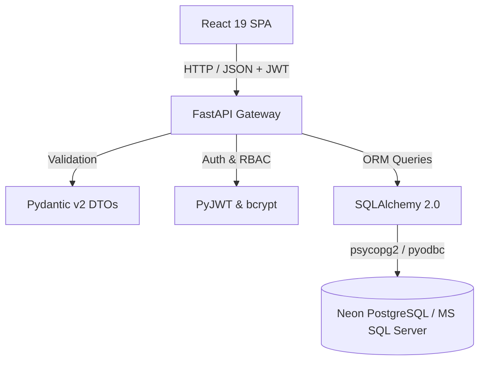

<p align="center">
  
</p>

<h1 align="center">QuestFlow</h1>
<p align="center">
  <strong>Complete Tasks. Earn Progress. Stay Motivated.</strong>
</p>

<p align="center">
  <a href="https://github.com/Shimrah07/QuestFlow"></a>
  <a href="https://github.com/Shimrah07/QuestFlow"></a>
  <a href="https://github.com/Shimrah07/QuestFlow"></a>
  <a href="https://github.com/Shimrah07/QuestFlow"></a>
  <a href="https://github.com/Shimrah07/QuestFlow"></a>
  <a href="https://github.com/Shimrah07/QuestFlow"></a>
  <a href="https://github.com/Shimrah07/QuestFlow"></a>
  <a href="https://github.com/Shimrah07/QuestFlow"></a>
</p>

---

QuestFlow is a full-stack gamified productivity platform that helps teams manage projects, tasks, and expenses through an engaging XP-based progression system. It combines modern UI, secure authentication, role-based access control, and real-time leaderboards into a collaborative productivity experience.

---

# 🌐 Live Demo

- **Frontend Application:** *Coming Soon*
- **Backend API Documentation:** *Coming Soon*

---

# ✨ Highlights

- **JWT Authentication:** Dual-token mechanism with access and refresh token rotation.
- **Role-Based Access Control (RBAC):** Three distinct authorization tiers (`Admin`, `Manager`, `Employee`).
- **Gamified XP System:** Server-validated XP awarding upon task completion.
- **Achievements & Levels:** Dynamic level calculations and badge unlock evaluation.
- **Real-Time Leaderboards:** Standings filtered by active users sorted by total earned XP.
- **Expense Approval Workflow:** Multi-tier claim submissions with self-approval prevention.
- **Project Operations:** CRUD operations with soft-delete archival and search filtering.
- **Responsive Design:** Dark-mode glassmorphic interface tailored for mobile, tablet, and desktop.
- **Automated Testing:** 64 E2E browser automation tests with Playwright and Pytest backend coverage.
- **FastAPI REST API:** Async endpoints with Pydantic v2 data validation schemas.
- **SQL Server Integration:** Relational database integration via SQLAlchemy 2.0 and PyODBC.

---

# 📸 Screenshots

| Feature | Preview |
| :--- | :--- |
| **Login Page** |  |
| **Dashboard** |  |
| **Task Operations** |  |
| **Leaderboard** |  |
| **Expense Management** |  |
| **Dark Theme & Glassmorphism** |  |

---

## 🛠️ Tech Stack

| Layer | Technology |
| :--- | :--- |
| **Frontend** | React 19, Vite 8, Tailwind CSS v4, Framer Motion, Lucide Icons, Recharts, Playwright E2E |
| **Backend** | Python 3.14, FastAPI, SQLAlchemy 2.0 ORM, Pydantic v2, PyJWT, Pytest |
| **Database** | MS SQL Server / SQL Server Express via PyODBC |
| **Security** | JWT Access & Refresh Token Rotation, bcrypt Password Hashing, RBAC Middleware |

---

## 📁 Repository Layout

```text
QuestFlow/
├── backend/
│   ├── app/
│   │   ├── core/                  # Security, JWT, Pydantic config settings
│   │   ├── db/                    # SQLAlchemy engine & base metadata
│   │   ├── models/                # Database entities (User, Task, Expense, Project)
│   │   ├── routes/                # FastAPI APIRouter endpoints
│   │   └── schemas/               # Request/Response DTOs
│   ├── scripts/                   # Database seed utilities (seed_e2e_users.py)
│   └── tests/                     # Pytest backend test suite
│
├── frontend/
│   ├── e2e/                       # Playwright end-to-end spec suite
│   ├── public/                    # Static brand assets (logo.svg, favicon.svg)
│   ├── src/
│   │   ├── components/            # UI components (Sidebar, Navbar, Cards, Charts)
│   │   ├── context/               # AuthContext, NotificationContext
│   │   ├── layouts/               # AuthLayout, DashboardLayout
│   │   ├── pages/                 # Full view containers (Dashboard, Tasks, Expenses)
│   │   └── services/              # Axios HTTP client with refresh rotation
│   └── index.html                 # Browser entry point & metadata
└── docs/                          # Architectural blueprints & documentation
```

---

## 🔐 Demo Credentials (Single Source of Truth)

All local dev and automated test setups use these standardized demo accounts:

| Role | Email | Password | Access Tier |
| :--- | :--- | :--- | :--- |
| **Admin** | `admin@gmail.com` | `Admin@123` | Full System Access (Manage Users, Projects, Reports) |
| **Manager** | `manager@gmail.com` | `Manager@123` | Operational Access (Create Tasks, Review Approvals) |
| **Employee** | `employee@gmail.com` | `Employee@123` | Individual Access (Complete Tasks, Submit Expenses) |

---

## ⚙️ Environment Variables

Copy the `.env.example` schema into `.env` at project root:

```env
PROJECT_NAME="QuestFlow"
ENVIRONMENT="development"
API_V1_STR="/api/v1"

# Database Configuration (MS SQL Server)
DATABASE_URL="mssql+pyodbc://localhost/TaskExpenseDB?driver=ODBC+Driver+17+for+SQL+Server&trusted_connection=yes"

# JWT Token Security (Must be set in production)
JWT_SECRET_KEY="your-secure-access-token-secret-key-here"
JWT_REFRESH_SECRET_KEY="your-secure-refresh-token-secret-key-here"
ACCESS_TOKEN_EXPIRE_MINUTES=15
REFRESH_TOKEN_EXPIRE_DAYS=7

# CORS Origins
ALLOWED_ORIGINS="http://localhost:5173,http://127.0.0.1:5173"
```

---

## 🚀 Quick Start Guide

### 1. Backend Setup

```powershell
cd backend
python -m venv venv
.\venv\Scripts\Activate.ps1
pip install -r requirements.txt
python scripts/seed_e2e_users.py
python -m uvicorn app.main:app --host 127.0.0.1 --port 8000
```

### 2. Frontend Setup

```powershell
cd frontend
npm install
npm run dev
```

Open [http://localhost:5173](http://localhost:5173) in your browser.

---

## 🧪 Testing Suite

### Backend Unit & Integration Tests (Pytest)
```powershell
cd backend
$env:PYTHONPATH="."
.\venv\Scripts\pytest -v
```

### Frontend Production Build
```powershell
cd frontend
npm run build
```

### End-to-End Browser Automation (Playwright)
```powershell
cd frontend
npx playwright test
```

---

## 🏗️ System Architecture



---

# 🚀 Production Deployment

- **Frontend Hosting:** Vercel / Netlify
- **Backend Service:** Render Web Service (Python + FastAPI)
- **Production Database:** Neon PostgreSQL Serverless (`postgresql://...`)
- **Local Dev Database:** MS SQL Server (`mssql+pyodbc://...`) or PostgreSQL
- **Security Protocols:** HTTPS + JWT Access & Refresh Token Rotation

---

## 👨‍💻 About This Project

QuestFlow was built as a portfolio-quality full-stack application to demonstrate modern software engineering practices, secure authentication, enterprise-inspired architecture, automated testing, and responsive user experience using React, FastAPI, SQL Server, and Playwright.

---

## 📄 License

Distributed under the MIT License. See `LICENSE` for more information.
