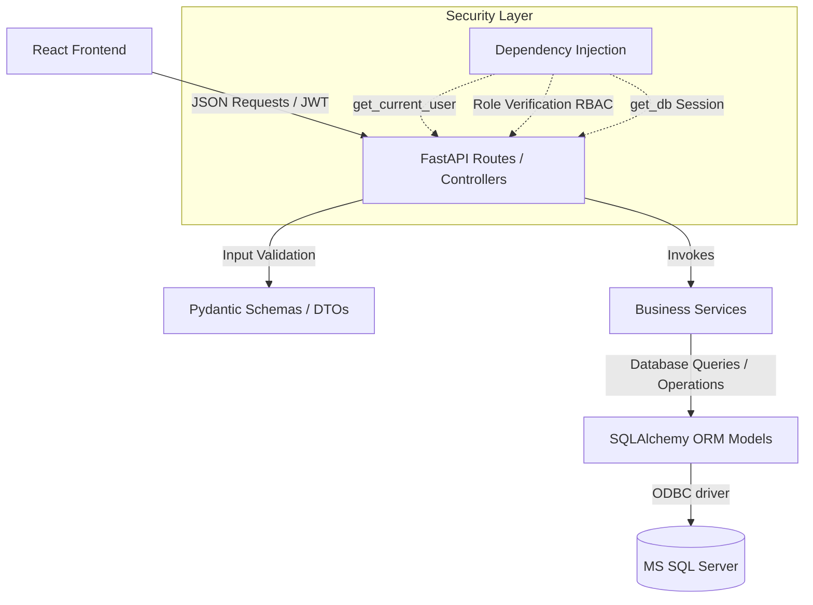
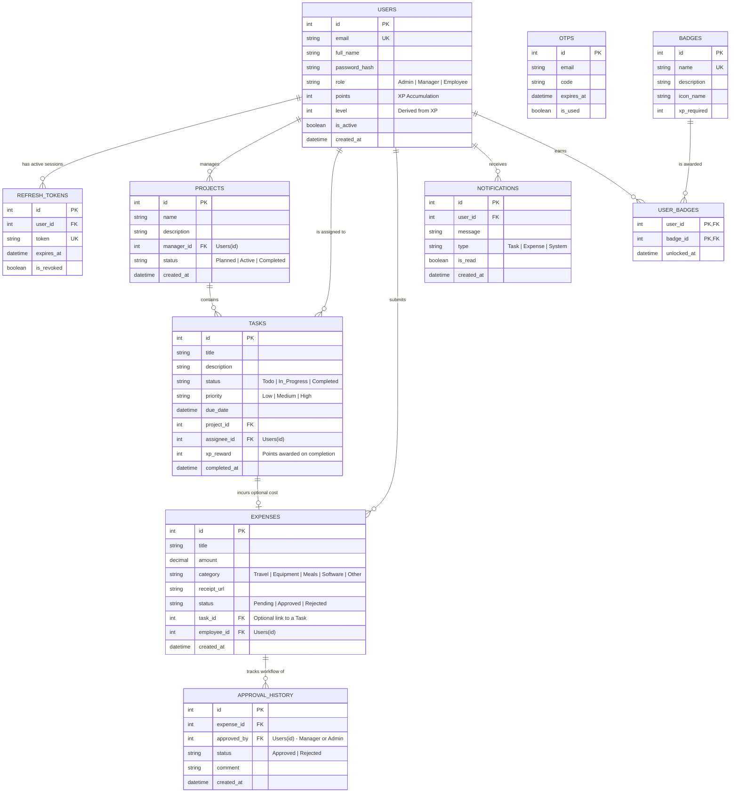

# Gamified Task & Expense Management System
## Full-Stack Architecture Blueprint & Implementation Guide

This blueprint provides a scalable, secure, and professional architectural design tailored for an internship-level showcase. The application features **Role-Based Access Control (RBAC)**, robust **JWT authentication (with refresh token rotation)**, an **approval workflow engine**, and **gamification elements** to motivate user engagement.

---

## 1. Project Directory Structure

The project has been structured into separate `backend` (FastAPI) and `frontend` (React + Vite + Tailwind CSS v4) directories to ensure strict separation of concerns. Below is the recommended layout for both modules:

```text
task-expense-management/
├── backend/
│   ├── app/
│   │   ├── core/                  # Application configuration, security, and constants
│   │   │   ├── config.py          # Environment variable validation via pydantic-settings
│   │   │   ├── security.py        # Password hashing, JWT token generation & verification
│   │   │   └── deps.py            # FastAPI dependency injection helpers (get_db, get_current_user)
│   │   ├── db/                    # Database connections and sessions
│   │   │   ├── session.py         # SQLAlchemy engine & session maker for MS SQL Server
│   │   │   └── base.py            # Base declarative model class for SQLAlchemy
│   │   ├── models/                # SQLAlchemy database entities (ORM)
│   │   │   ├── user.py            # User, RefreshToken, and OTP entities
│   │   │   ├── project.py         # Project entity
│   │   │   ├── task.py            # Task entity
│   │   │   ├── expense.py         # Expense and ApprovalHistory entities
│   │   │   ├── notification.py    # Notification entity
│   │   │   └── gamification.py    # Badge, UserBadge, and Audit logs
│   │   ├── schemas/               # Pydantic schemas (Request/Response DTOs)
│   │   │   ├── auth.py
│   │   │   ├── project.py
│   │   │   ├── task.py
│   │   │   ├── expense.py
│   │   │   └── gamification.py
│   │   ├── services/              # Business logic controllers
│   │   │   ├── auth_service.py    # Auth, OTP, CAPTCHA, Refresh rotation logic
│   │   │   ├── task_service.py    # Tasks and XP (Gamification) calculations
│   │   │   ├── expense_service.py # Expense creation and validation
│   │   │   ├── approval_service.py# Workflow state transitions (Manager/Admin approvals)
│   │   │   └── gamification_service.py # Leaderboard calculations and badge triggers
│   │   ├── routes/                # FastAPI APIRouter endpoints (grouped by module)
│   │   │   ├── auth.py
│   │   │   ├── projects.py
│   │   │   ├── tasks.py
│   │   │   ├── expenses.py
│   │   │   ├── dashboard.py
│   │   │   └── gamification.py
│   │   └── main.py                # Application entry point, middleware, exception handlers
│   ├── tests/                     # Pytest suite
│   ├── requirements.txt           # Python dependencies (FastAPI, PyJWT, SQLAlchemy, pyodbc)
│   └── alembic.ini                # Alembic database migrations configuration
│
├── frontend/
│   ├── public/                    # Static assets
│   ├── src/
│   │   ├── assets/                # Images, icons, and theme logo
│   │   ├── components/            # Reusable core elements
│   │   │   ├── common/            # Button, Input, Modal, Loader, Badge, Tooltip
│   │   │   ├── charts/            # Recharts components (Expense distributions, Task burndown)
│   │   │   ├── dashboard/         # StatCards, LeaderboardList, XPProgressBar
│   │   │   └── tasks/             # TaskCard, TaskBoard (Kanban)
│   │   ├── layouts/               # Page wrapper templates
│   │   │   ├── AuthLayout.jsx     # Side banner + form containers (Login/Register/Reset)
│   │   │   └── DashboardLayout.jsx# Sidebar navigation, navbar profile, notification center
│   │   ├── pages/                 # Full view containers
│   │   │   ├── auth/              # Login, Register, ForgotPassword, OTPVerify
│   │   │   ├── dashboard/         # Main interactive analytics display
│   │   │   ├── projects/          # Project list and details view
│   │   │   ├── tasks/             # List/Board view of tasks
│   │   │   ├── expenses/          # Expense upload & list view
│   │   │   ├── approvals/         # Approver-only queue (Managers/Admins)
│   │   │   └── gamification/      # Leaderboard, Badges, and achievements gallery
│   │   ├── routes/                # Navigation and access controllers
│   │   │   ├── ProtectedRoute.jsx # Wrapper for RBAC & authentication checking
│   │   │   └── index.jsx          # Route tree definitions (React Router v7)
│   │   ├── services/              # API interfaces
│   │   │   ├── api.js             # Base Axios instance with automatic Refresh Token rotation interceptor
│   │   │   ├── auth.js            # Auth API mappings
│   │   │   ├── tasks.js           # Task API mappings
│   │   │   └── expenses.js        # Expense API mappings
│   │   ├── context/               # Global state providers
│   │   │   ├── AuthContext.jsx    # User session, JWT expiration tracking
│   │   │   └── NotificationContext.jsx # Real-time-like polling or toast notification state
│   │   ├── hooks/                 # Custom custom react hooks (useAuth, useLocalStorage)
│   │   ├── utils/                 # Formatting, validations, math
│   │   ├── index.css              # Global styles & Tailwind CSS core setup
│   │   └── main.jsx               # Application bootstrap
│   ├── package.json               # Frontend dependencies (React, Recharts, Lucide, Framer Motion)
│   └── vite.config.js             # Development configurations
```

---

## 2. Backend Architecture Overview

The backend uses a **Layered Architecture (N-Tier)** which separates routes (HTTP delivery), business logic (Services), database models (Data Definition), and client schemas (Validation).



### Key Technical Aspects:
1. **FastAPI Dependency Injection (`Depends`)**:
   - Database sessions (`get_db`) are created per request and cleaned up automatically.
   - Current user validation (`get_current_user`) decodes the access token and injects the authenticated `User` object directly into route signatures.
   - Role-Based Access Control is enforced through custom dependencies. For example: `Depends(RoleChecker(["Admin", "Manager"]))`.

2. **Security & Session Management**:
   - **Password Security**: Hashed via `bcrypt` / `passlib` using `PBKDF2` or `argon2` standards.
   - **Double-Token Auth Mechanism**: 
     - **Access Token**: Short-lived (e.g., 15 minutes) JWT containing `user_id`, `role`, and token scopes.
     - **Refresh Token**: Long-lived (e.g., 7 days) cryptographic random string stored securely in the database (`RefreshToken` table) to verify authenticity and enable instant, selective revoking of active devices.
   - **Forgot Password Flow & OTP**: Verification of identity via structured, time-limited OTP tokens saved temporarily in the database.
   - **Input Sanitation**: Built-in protection against SQL injection (using SQLAlchemy bound parameters) and HTML input validation using `Pydantic` validators.

---

## 3. Database Entities (ERD Overview)

Below is the structured relational schema representing the system entities. The relationships reflect strict validation cascades, role allocations, and tracking mechanisms.



---

## 4. Recommended API Structure

All endpoint URLs should be prefixed with `/api/v1` for scalability and clean versioning support.

### Auth Module (`/api/v1/auth`)
* `POST /register` - Registers a new user (Default Role: `Employee`). Supports CAPTCHA code verification in payload.
* `POST /login` - Validates credentials, returns JWT `access_token` and `refresh_token`.
* `POST /refresh` - Swaps valid, unexpired `refresh_token` for a fresh `access_token`.
* `POST /forgot-password` - Validates email and triggers OTP generation and transmission.
* `POST /verify-otp` - Validates the OTP.
* `POST /reset-password` - Changes password using the validated OTP signature.

### Projects Module (`/api/v1/projects`)
* `GET /` - Fetches all projects (Filtered based on Role: Admins/Managers see all; Employees see active/assigned).
* `POST /` - Creates a project (**Managers & Admins only**).
* `GET /{id}` - Fetches a single project detailing tasks and team lists.
* `PUT /{id}` - Updates a project (**Managers & Admins only**).

### Tasks Module (`/api/v1/tasks`)
* `GET /` - Fetches tasks. Accepts filters: status, assignee, priority, and current user active tasks.
* `POST /` - Creates task, computes baseline XP points rewards based on due date and priority (**Managers & Admins only**).
* `GET /{id}` - Detail view of a task.
* `PUT /{id}` - Update task details or reassignment.
* `PATCH /{id}/status` - Update task status (e.g. `Completed`). Triggers the **Gamification Engine** to award XP points to `assignee_id` upon successful status update.

### Expenses Module (`/api/v1/expenses`)
* `GET /` - List expenses. (Employees see their submissions; Managers/Admins see all for review).
* `POST /` - Submits a new expense with a receipt attachment.
* `GET /{id}` - Fetches detailed receipt, metadata, task connections, and approval logs.

### Expense Approvals Module (`/api/v1/approvals`)
* `GET /queue` - Lists all `Pending` expenses awaiting approval (**Managers & Admins only**).
* `POST /{expense_id}` - Review submission: updates status to `Approved` or `Rejected` and logs audit comment.

### Gamification & Dashboard Analytics Module (`/api/v1/gamification` & `/api/v1/dashboard`)
* `GET /gamification/leaderboard` - Lists users ordered by total XP points (competitive, gamified view).
* `GET /gamification/badges` - Fetch available badges and unlock statuses for current user.
* `GET /dashboard/employee-metrics` - Total XP, Tasks completed vs overdue, Expense totals.
* `GET /dashboard/manager-analytics` - High-level metrics: team efficiency ratios, approved budget aggregates, pending expense charts.

---

## 5. Frontend Architecture & UI Overview

To capture a **premium, dark futuristic SaaS aesthetic**, the UI will implement a sleek color theme built around a deep dark background, neon accents, and clean borders.

### 1. Futuristic Design System Configuration
Inside Tailwind CSS v4, we can define our theme utility tokens to maintain consistency across the interface:
```css
/* Color Palette definition for Futuristic Cyber theme */
--color-bg-deep: #090d16;       /* Space black/deep cobalt */
--color-panel: #131c31;         /* Glassmorphic card background */
--color-neon-violet: #8b5cf6;   /* Primary actions, active navigation glow */
--color-neon-emerald: #10b981;  /* Level completions, points gain, approvals */
--color-neon-amber: #f59e0b;    /* Warning, pending approvals, in-progress tasks */
--color-neon-rose: #f43f5e;     /* Red alert, rejected items, high priority tasks */
```

### 2. State & HTTP Pipeline Organization

* **Context Layer (`AuthContext`)**:
  - Globally manages user state, active roles, and logged-in tokens.
  - Automatically loads profile data on boot if a JWT is present in local memory.
* **Axios Pipeline Interceptor (`services/api.js`)**:
  - Attaches the Access Token to every outgoing HTTP header.
  - Detects `401 Unauthorized` responses: intercepts request, calls `/api/v1/auth/refresh`, updates the token, and retries the original request seamlessly.
* **Navigation Protection (`routes/ProtectedRoute.jsx`)**:
  - Evaluates authentication status.
  - Performs **Role-Based Check** (e.g., if a user attempts to access `/approvals` but their role is `Employee`, it redirects them to `/dashboard` with a forbidden alert).

---

## 6. Implementation & Development Phases

Following this sequential progression ensures the project remains organized and avoids overengineering early in development:

### Phase 1: Core Authentication & Database Foundation
* Configured MS SQL database sessions with SQLAlchemy.
* Implement Alembic for migrations, setting up the base `User` entity.
* Build Auth APIs (`/register`, `/login`, `/refresh`) with password hashing and double-token JWT issuance.

### Phase 2: Frontend Base Layouts & Route Guards
* Build the base Dark Futuristic SaaS theme structure.
* Configure layouts: `AuthLayout` (minimalistic glowing cards) and `DashboardLayout` (collapsible sidebars).
* Create the Axios HTTP interceptor and implement the `ProtectedRoute` wrapper for secure route traversal.

### Phase 3: Project & Task Modules
* Implement backend endpoints and database schemas for Projects and Tasks.
* Create Pydantic input models to prevent invalid parameter states.
* Build the React views: Project detail page and Kanban Taskboard for easy status adjustments.

### Phase 4: Expense Workflow Implementation
* Build database tables for Expenses and Approval histories.
* Implement endpoints to upload attachments (receipts) and link them to tasks.
* Build the Approval workflow API.
* Create the **Approver Queue View** on React, displaying side-by-side expense data and receipts with "Approve" or "Reject" actions.

### Phase 5: Gamification Engine & Visual Analytics
* Implement status changes on Tasks to trigger computed user point adjustments.
* Add backend triggers to automatically award badges when certain thresholds (XP milestones, number of tasks completed) are met.
* Connect Recharts components in the frontend: render visual bar/pie charts representing expenditures and complete/pending workflows.
* Add micro-animations (Framer Motion) on XP increments, glowing card highlights, and level-up announcements.

### Phase 6: Polish, Hardening & Security Audit
* Put in place rate limiters for login and OTP endpoints.
* Integrate CAPTCHA validation.
* Conduct validation checks to ensure users cannot approve their own expenses or access administrative routes.
